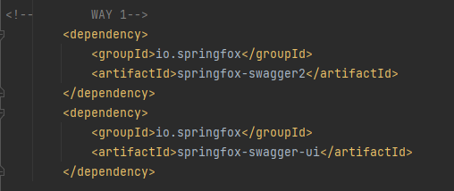
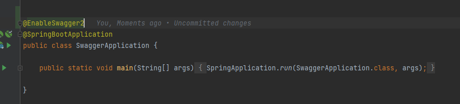
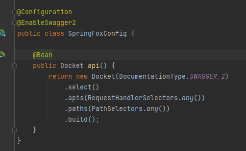
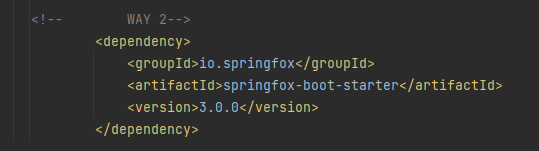
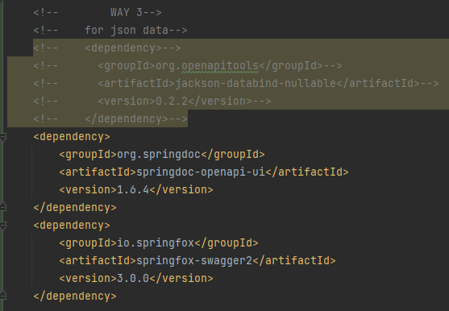

# Swagger

# How to config swagger

3 ways to config 

## ============================= WAY 1 =============================

this way can conflict



Enable swagger 2




Enable swagger2 and Swagger configuration is done using Docket Bean, below is a simple configuration to integrate
Swagger with Spring Boot, you can add more customization to your documentation in the Docket Bean, also you may create
more than one Docket Bean.




## ============================= WAY 2 =============================




Add a config in `yml` file
```yml
spring:
  mvc:
    pathmatch:
      matching-strategy: ant_path_matcher

OR

spring.mvc.pathmatch.matching-strategy=ANT_PATH_MATCHER
```

## ============================= WAY 3 =============================

Cách 3 sẽ dùng openAPI nên sẽ không cần config gì thêm





# Access to `http://localhost:8080/swagger-ui/` for way 2
# Access to `http://localhost:8080/swagger-ui/index.html` for way 3


