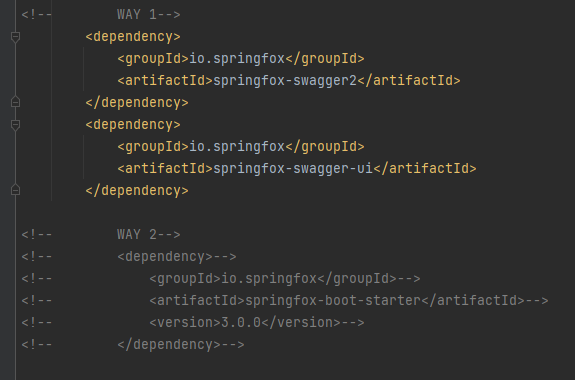
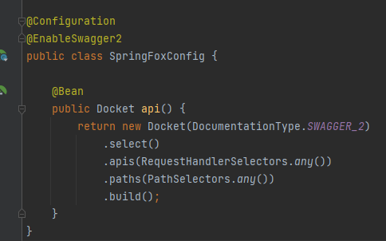
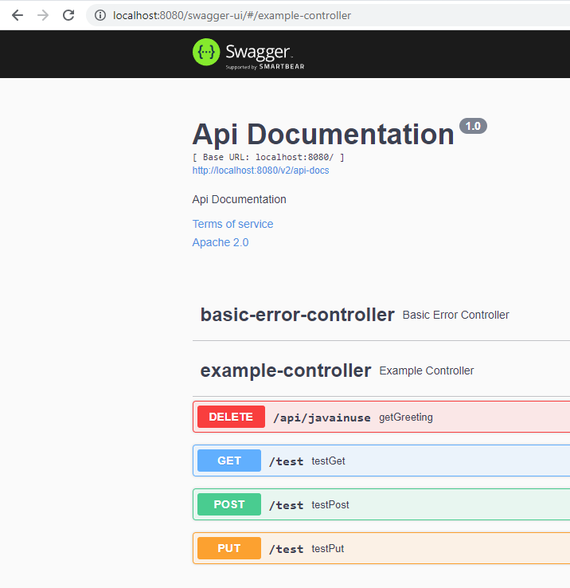

# Swagger

# How to config swagger

2 ways to config 



Enable swagger2 and Swagger configuration is done using Docket Bean, below is a simple configuration to integrate
Swagger with Spring Boot, you can add more customization to your documentation in the Docket Bean, also you may create
more than one Docket Bean.



Add a config in `yml` file

```xml
spring:
  mvc:
    pathmatch:
      matching-strategy: ant_path_matcher

OR

spring.mvc.pathmatch.matching-strategy=ANT_PATH_MATCHER
```

Access to `http://localhost:8080/swagger-ui/`


